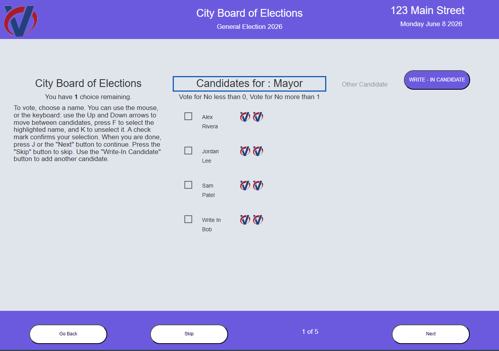
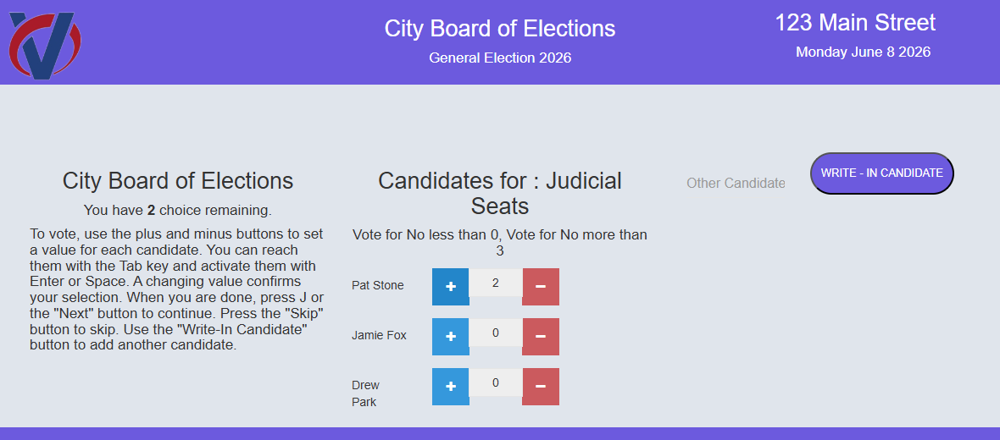

# VotRite Keyboard‑First Accessibility — Test Report

Verification performed against the **real running Laravel application** (served
with `php artisan serve` on PHP 7.4) using the bundled mock API for data. Tools:
axe‑core 4.x via Puppeteer (headless Chrome), plus scripted keyboard interaction.

## 1. Automated WCAG check (axe‑core, WCAG 2.0/2.1 A & AA)

| Page | 800px (mobile) | 1366px (desktop) |
| --- | --- | --- |
| Candidate selection (`/client/viewcand`) | **0 violations** | **0 violations** |
| Propositions (harness) | **0 violations** | **0 violations** |
| Review (harness) | **0 violations** | **0 violations** |

No violations for name/role/value, ARIA, focus order, focus visible, or color
contrast.

**Resolved during testing:** an initial contrast finding — white text on the
brand purple `#7864f7` measured **4.22:1** (just under the 4.5:1 AA threshold for
normal text). Fixed by darkening the voter header/footer and the Write‑In button
to `#6c5ade` (**~5.05:1**). One axe "candidate label" flag was confirmed a **false
positive** by screenshot (the theme’s dark body color sits behind a light
content wrapper; the names render dark‑on‑light and are clearly legible).

## 2. Keyboard operation (verified on the live app)

| Input | Result |
| --- | --- |
| Focus on load | Moves to the contest heading; visible focus ring |
| `↓` / `↑` | Move between candidates (announced) |
| `F` | Selects the focused candidate (vote count updates) |
| `K` | Deselects |
| `J` / `→` | Advance to the next contest |
| `D` / `←` / `Esc` | Go back |
| `Space` / `Enter` | Activate focused control / toggle choice |
| Ranked‑choice `+/−` spinner | **Enter/Space now change the value** (was mouse‑only) |
| Full ballot | Marked and **cast end‑to‑end** by keyboard → "You are Voted" |

Sample run: `ArrowDown`→`F` selected “Alex Rivera”, “choices remaining” 1→0;
`K` deselected; `F`+`J` advanced to “City Council”. Ranked spinner: `Space`×2 set
a candidate to 2, `Enter` on `−` brought it to 1.

## 3. Screenshots

Candidate selection — accessibility layer live (darkened header/footer & Write‑In
button for contrast; focus ring on the contest heading):



Ranked‑choice contest — value set to 2 entirely by keyboard (Tab to `+`, Space ×2):



## 4. Regression

Mouse/touch operation unchanged; the keyboard layer is additive and gated behind
`KEYBOARD_NAV_ENABLED` for instant rollback.

## 5. Not covered (requires client / real devices)

- **Manual screen‑reader audio** passes: NVDA, JAWS, VoiceOver (desktop + iOS),
  TalkBack (Android). axe verifies structure/contrast and scripted keyboard
  verifies operability, but no human has listened to the spoken output — this is
  the final validation for blind voters and remains to be done.
- **Cross‑browser** (Firefox/Safari) and **mobile** rendering/interaction.
- Validation against the **real backend** (testing used the bundled mock).

## How to reproduce

```bash
composer install
cp .env.example .env   # set API=http://127.0.0.1:9191/api, APP_URL/ASSET_URL=http://127.0.0.1:8000
php artisan key:generate && php artisan config:clear
node mock-api/server.mjs            # terminal 1
php artisan serve                   # terminal 2
cd accessibility-harness && npm install && npm run test:a11y   # axe check
```
